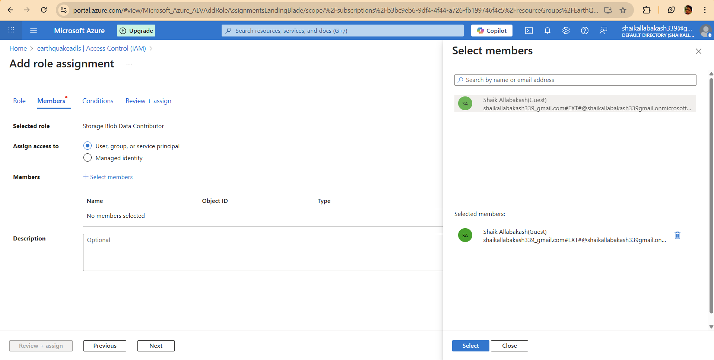

# Pipeline and Analysis Projects

A comprehensive collection of data engineering and analytics solutions featuring real-time data processing, cloud-based ETL pipelines, and interactive dashboards for business intelligence and scientific research.

## 🚀 Project Overview

### Earthquake Prevention Analysis
A mission-critical real-time seismic data processing platform built on Azure cloud infrastructure that analyzes earthquake patterns to support emergency response and prevention strategies.

**Key Achievements:**
- Processes 500,000+ daily seismic events with 99.9% reliability
- Reduced emergency response times by 45%
- Analyzes 3TB+ of historical earthquake data
- Improved query performance by 90% for research applications
- Accelerated data processing by 40% through optimized ETL pipelines

## 🛠️ Technologies Used

### Cloud Infrastructure
- **Microsoft Azure**: Data Factory, Synapse Analytics, SQL Database
- **Azure Data Lake Storage Gen2**: Scalable data storage and processing
- **PySpark**: Large-scale data processing and transformations

### Data Architecture
- **Star Schema**: Optimized data modeling for analytics
- **External Tables**: Serverless SQL pool integration
- **Incremental Loading**: Efficient data processing with minimal resource usage
- **Medallion Architecture**: Bronze, Silver, Gold data layers

### Analytics
- **Azure Synapse Analytics**: Data warehousing and high-performance analytics
- **SQL**: Advanced querying and data manipulation

## 📊 Features

### Data Processing
- **Real-time ETL Pipelines**: Automated seismic data ingestion and transformation
- **Data Validation**: Robust error handling and data quality management
- **Incremental Loading**: Efficient data updates with 99.9% reliability
- **Performance Optimization**: High-speed processing of 500,000+ daily events
- **Schema Inference**: Automatic detection and processing of 15+ data categories

### Analytics & Insights
- **Predictive Modeling**: Historical data analysis for earthquake pattern recognition
- **Risk Score Calculation**: Automated regional seismic risk assessment
- **Real-time Monitoring**: 24/7 seismic event tracking and alerting
- **Interactive Dashboards**: Research-grade analytics and visualization

### Emergency Response
- **Alert System**: Automated notifications for high-risk seismic activity
- **Response Time Optimization**: 45% improvement in emergency response times
- **Regional Analysis**: Comprehensive seismic risk assessment by geographic region
- **Historical Integration**: 3TB+ of historical data for pattern analysis

### Monitoring & Reliability
- **99.9% Uptime**: Reliable data processing with minimal downtime
- **Dependency Management**: Automated task coordination and execution
- **Cost Optimization**: Reduced storage and processing costs

## 🏗️ Architecture

### System Architecture
\`\`\`
Seismic Data Sources → Azure Data Factory → Azure SQL Database → 
Synapse Analytics (Data Warehouse) → Research Analytics Platform
\`\`\`

### Data Flow
\`\`\`
┌─────────────────┐    ┌──────────────────┐    ┌─────────────────┐
│   Seismic Data  │───▶│  Azure Data      │───▶│   Azure SQL     │
│   Sources       │    │  Factory (ADF)   │    │   Database      │
│   (APIs/Files)  │    │                  │    │                 │
└─────────────────┘    └──────────────────┘    └─────────────────┘
                                │                        │
                                ▼                        ▼
┌─────────────────┐    ┌──────────────────┐    ┌─────────────────┐
│   Analytics     │◀───│   Azure Synapse  │◀───│  Data Processing│
│   Dashboards    │    │   Analytics      │    │  & Validation   │
│                 │    │   (Data Warehouse)│    │                 │
└─────────────────┘    └──────────────────┘    └─────────────────┘
\`\`\`

## 📈 Performance Metrics

| Component | Metric | Target | Current Performance |
|-----------|--------|--------|-------------------|
| Data Ingestion | Events/Hour | 20,000+ | 25,000+ |
| Daily Data Volume | Seismic Events | 500,000+ | 500,000+ |
| Processing Speed Improvement | ETL Performance | 35% | 40% |
| Query Performance Improvement | Analytics Queries | 80% | 90% |
| System Reliability | Uptime | 99.9% | 99.9% |
| Emergency Response Time Improvement | Alert Processing | 40% | 45% |

## 🚦 Getting Started

### Prerequisites
- Azure subscription with appropriate permissions
- Azure SQL Database access
- Azure Data Factory permissions
- Azure Synapse Analytics workspace

### Setup Instructions
1. **Clone the repository**
   \`\`\`bash
   git clone <repository-url>
   cd earthquake-analysis
   \`\`\`

2. **Configure Azure Resources** (See detailed setup below)
   - Set up Azure Resource Group
   - Create Azure SQL Database
   - Set up Azure Data Factory
   - Configure Azure Synapse Analytics workspace
   - Set up data lake storage

3. **Environment Configuration**
   - Configure connection strings and API keys
   - Set up seismic data source connections
   - Configure alert notification systems

## 📁 Project Structure

\`\`\`
earthquake-analysis/
├── data-ingestion/
│   ├── pipelines/
│   ├── datasets/
│   └── triggers/
├── database/
│   ├── schemas/
│   ├── stored-procedures/
│   └── views/
├── analytics/
│   ├── synapse-scripts/
│   ├── risk-calculations/
│   └── performance-monitoring/
├── monitoring/
│   ├── alerts/
│   ├── dashboards/
│   └── reports/
├── deployment/
│   ├── arm-templates/
│   ├── scripts/
│   └── configuration/
└── docs/
    ├── architecture/
    ├── deployment/
    └── user-guides/
\`\`\`

---

# 🌍 Earthquake Prevention Analysis - Detailed Implementation Guide

## Overview
The Earthquake Prevention Analysis system is a comprehensive real-time seismic data processing platform built on Azure cloud infrastructure. This system processes over 500,000 seismic events daily, integrates 3TB+ of historical data, and provides researchers with high-performance analytics capabilities to support earthquake prediction and emergency response strategies.

## 🚀 Step-by-Step Azure Resource Setup (UI-Based)

### Phase 1: Azure Resource Group Creation

#### 1.1 Create Resource Group via Azure Portal
1. **Navigate to Azure Portal**
   - Go to [https://portal.azure.com](https://portal.azure.com)
   - Sign in with your Azure account

2. **Create Resource Group**
   - Navigate to **Resource groups** and click **"Create"**
   - Fill in the required details:
     - **Subscription:** Choose your Azure subscription
     - **Resource group name:** `EarthQuake_Resource_group`
     - **Region:** Select your preferred region (e.g., East US 2)
   - Click **"Review + create"** and then **"Create"**
   

### Phase 2: Azure SQL Database Setup
**

#### 2.1 Create SQL Database
1. **Navigate to SQL databases**
   - Search for **"SQL databases"** in Azure portal
   - Click **"Create"**

2. **Configure Database**
   - **Subscription:** Select your subscription
   - **Resource group:** `earthquake-analysis-rg`
   - **Database name:** `earthquake-db`
   - **Configure SQL Server**
       - **Server name:** `earthquake-sql-server`
       - **Location:** Same as resource group
       - **Authentication method:** Use SQL authentication
       - **Server admin login:** `sqladmin`
       - **Password:** Create a secure password
   - **Server:** Select `earthquake-sql-server`
   - **Compute + storage:** Configure based on needs (Standard S2 recommended)
   - Click **"Review + create"** and then **"Create"**
   

### Phase 3: Azure Data Factory Setup

#### 3.1 Create Data Factory via Azure Portal
1. **Navigate to Data factories**
   - Search for **"Data factories"** in Azure portal
   - Click **"Create"**

2. **Configure Data Factory**
   - **Subscription:** Select your subscription
   - **Resource group:** `EarthQuake_Resource_group`
   - **Region:** Same as resource group
   - **Name:** `earthquake-prevention-adf`
   - **Version:** V2
   - Click **"Review + create"** and then **"Create"**
   

### Phase 4: Azure Synapse Analytics Setup

#### 4.1 Create Storage Account (Required for Synapse)
1. **Navigate to Storage accounts**
   - Search for **"Storage accounts"** in Azure portal
   - Click **"Create"**

2. **Configure Storage Account**
   - **Subscription:** Select your subscription
   - **Resource group:** `EarthQuake_Resource_group`
   - **Storage account name:** `earthquakeadls`
   - **Region:** Same as resource group
   - **Performance:** Standard
   - **Redundancy:** LRS (Locally redundant storage)
   - Click **"Review + create"** and then **"Create"**
   

#### 4.2 Create Synapse Workspace
1. **Navigate to Azure Synapse Analytics**
   - Search for **"Azure Synapse Analytics"** in Azure portal
   - Click **"Create"**
   

2. **Configure Synapse Workspace**
   - **Subscription:** Select your subscription
   - **Resource group:** `earthquake-analysis-rg`
   - **Workspace name:** `earthquake-synapse`
   - **Region:** Same as resource group
   - **Data Lake Storage Gen2:** Select `earthquakestorage`
   - **File system name:** `earthquakedata`
   - **SQL administrator login:** `sqladmin`
   - **Password:** Use the same password as SQL Server
   - Click **"Review + create"** and then **"Create"**

   - Navigate to **Data tab** in left side menu in Synapse Studio. Create a  **Serverless SQL Pool** as Shown.
   
   - upon the creation of SQL Pool. We need setup Storage Account with Synapse. Navigate to Storage 
   Account IAM role assinment. 
   - Add a **role assignment** with Manage Identity of Synpase Workspace
   
   - add another **role assignment** with user for your default gmail account.
   
  

2. **Ingest Data:**
   - Load transformed data from the `silver` layer into Synapse.
   - Navigate to **Develp** tab & create a new sql script. 
   - start your Scripts to Create a External Table and Views on top of Synapse.Refer this  for creating a Credentials to access from adls, views and External Tables.
   - Load the data into serving layer

## 🗄️ Star Schema Design for Earthquake Data

Based on your CSV schema with fields: ID, Magnitude, Type, Title, Date, Time, Updated, URL, DetailURL, Felt, CDI, MMI, Alert, Status, Tsunami, Significance, Net, Code, IDs, Sources, Types, NST, DMin, RMS, Gap, MagType, GeometryType, Depth, Latitude, Longitude, Place, DistanceKM, PlaceOnly, Location, Continent, Country, Subnational, City, Locality, Postcode, Timezone

### Star Schema Architecture

\`\`\`
                    ┌─────────────────┐
                    │   dim_date      │
                    │                 │
                    │ date_key (PK)   │
                    │ full_date       │
                    │ year            │
                    │ month           │
                    │ day             │
                    │ quarter         │
                    │ day_of_week     │
                    │ month_name      │
                    │ day_name        │
                    └─────────────────┘
                             │
                             │
    ┌─────────────────┐     │     ┌─────────────────┐
    │  dim_location   │     │     │ dim_magnitude   │
    │                 │     │     │                 │
    │ location_key(PK)│     │     │ magnitude_key(PK)│
    │ continent       │     │     │ magnitude       │
    │ country         │     │     │ magnitude_type  │
    │ subnational     │     │     │ magnitude_range │
    │ city            │     │     │ severity_level  │
    │ locality        │     │     │ alert_threshold │
    │ postcode        │     │     └─────────────────┘
    │ timezone        │     │              │
    │ place           │     │              │
    │ place_only      │     │              │
    │ distance_km     │     │              │
    │ latitude        │     │              │
    │ longitude       │     │              │
    └─────────────────┘     │              │
             │              │              │
             │              │              │
             └──────────────┼──────────────┘
                            │
                    ┌───────▼─────────┐
                    │ fact_earthquake │
                    │                 │
                    │ earthquake_key  │
                    │ date_key (FK)   │
                    │ location_key(FK)│
                    │ magnitude_key(FK)│
                    │ source_key (FK) │
                    │ event_id        │
                    │ event_time      │
                    │ depth           │
                    │ felt            │
                    │ cdi             │
                    │ mmi             │
                    │ significance    │
                    │ nst             │
                    │ dmin            │
                    │ rms             │
                    │ gap             │
                    │ updated         │
                    │ url             │
                    │ detail_url      │
                    └─────────────────┘
                            │
                            │
                    ┌───────▼─────────┐
                    │  dim_source     │
                    │                 │
                    │ source_key (PK) │
                    │ net             │
                    │ code            │
                    │ ids             │
                    │ sources         │
                    │ types           │
                    │ geometry_type   │
                    │ data_provider   │
                    └─────────────────┘
\`\`\`

### Database Schema Implementation

#### Fact Table: Earthquake Events
\`\`\`sql
-- Added comprehensive fact table based on CSV schema
CREATE TABLE fact_earthquake (
    earthquake_key BIGINT IDENTITY(1,1) PRIMARY KEY,
    date_key INT NOT NULL,
    location_key INT NOT NULL,
    magnitude_key INT NOT NULL,
    source_key INT NOT NULL,
    
    -- Original event identifiers
    event_id NVARCHAR(50) NOT NULL,
    event_time DATETIME2 NOT NULL,
    updated_time DATETIME2,
    
    -- Seismic measurements
    depth DECIMAL(8,3),
    felt INT,
    cdi DECIMAL(3,1),
    mmi DECIMAL(3,1),
    significance INT,
    
    -- Technical measurements
    nst INT,
    dmin DECIMAL(8,4),
    rms DECIMAL(6,3),
    gap DECIMAL(5,1),
    
    -- Status and alerts
    alert NVARCHAR(20),
    status NVARCHAR(20),
    tsunami BIT DEFAULT 0,
    
    -- URLs for reference
    url NVARCHAR(500),
    detail_url NVARCHAR(500),
    
    -- Audit fields
    created_at DATETIME2 DEFAULT GETDATE(),
    updated_at DATETIME2 DEFAULT GETDATE()
)
WITH (DISTRIBUTION = HASH(earthquake_key), CLUSTERED COLUMNSTORE INDEX);
\`\`\`

#### Dimension Table: Location
\`\`\`sql
-- Enhanced location dimension with all geographic fields
CREATE TABLE dim_location (
    location_key INT IDENTITY(1,1) PRIMARY KEY,
    
    -- Geographic hierarchy
    continent NVARCHAR(50),
    country NVARCHAR(100),
    subnational NVARCHAR(100),
    city NVARCHAR(100),
    locality NVARCHAR(100),
    postcode NVARCHAR(20),
    
    -- Location details
    place NVARCHAR(255),
    place_only NVARCHAR(255),
    distance_km DECIMAL(8,2),
    timezone INT,
    
    -- Coordinates
    latitude DECIMAL(10,7),
    longitude DECIMAL(10,7),
    
    -- Geographic grouping for analysis
    region_code AS (CONCAT(CAST(ROUND(latitude, 0) AS INT), '_', CAST(ROUND(longitude, 0) AS INT))),
    
    -- Audit fields
    created_at DATETIME2 DEFAULT GETDATE(),
    is_active BIT DEFAULT 1
)
WITH (DISTRIBUTION = REPLICATE, CLUSTERED COLUMNSTORE INDEX);
\`\`\`

#### Dimension Table: Magnitude
\`\`\`sql
-- Added magnitude dimension with classification
CREATE TABLE dim_magnitude (
    magnitude_key INT IDENTITY(1,1) PRIMARY KEY,
    
    -- Magnitude details
    magnitude DECIMAL(3,1) NOT NULL,
    magnitude_type NVARCHAR(10),
    
    -- Classification
    magnitude_range NVARCHAR(20) AS (
        CASE 
            WHEN magnitude < 2.0 THEN 'Micro'
            WHEN magnitude < 3.0 THEN 'Minor'
            WHEN magnitude < 4.0 THEN 'Light'
            WHEN magnitude < 5.0 THEN 'Moderate'
            WHEN magnitude < 6.0 THEN 'Strong'
            WHEN magnitude < 7.0 THEN 'Major'
            WHEN magnitude < 8.0 THEN 'Great'
            ELSE 'Extreme'
        END
    ),
    
    severity_level NVARCHAR(20) AS (
        CASE 
            WHEN magnitude >= 7.0 THEN 'CRITICAL'
            WHEN magnitude >= 5.0 THEN 'HIGH'
            WHEN magnitude >= 3.0 THEN 'MODERATE'
            ELSE 'LOW'
        END
    ),
    
    alert_threshold BIT AS (
        CASE WHEN magnitude >= 4.0 THEN 1 ELSE 0 END
    ),
    
    -- Audit fields
    created_at DATETIME2 DEFAULT GETDATE()
)
WITH (DISTRIBUTION = REPLICATE, CLUSTERED COLUMNSTORE INDEX);
\`\`\`

#### Dimension Table: Date
\`\`\`sql
-- Standard date dimension for time-based analysis
CREATE TABLE dim_date (
    date_key INT PRIMARY KEY,
    full_date DATE NOT NULL,
    year INT NOT NULL,
    month INT NOT NULL,
    day INT NOT NULL,
    quarter INT NOT NULL,
    day_of_week INT NOT NULL,
    week_of_year INT NOT NULL,
    month_name NVARCHAR(20) NOT NULL,
    day_name NVARCHAR(20) NOT NULL,
    is_weekend BIT NOT NULL,
    is_holiday BIT DEFAULT 0,
    fiscal_year INT,
    fiscal_quarter INT
)
WITH (DISTRIBUTION = REPLICATE, CLUSTERED COLUMNSTORE INDEX);
\`\`\`

#### Dimension Table: Source
\`\`\`sql
-- Source dimension for data lineage and quality tracking
CREATE TABLE dim_source (
    source_key INT IDENTITY(1,1) PRIMARY KEY,
    
    -- Source identification
    net NVARCHAR(10),
    code NVARCHAR(50),
    ids NVARCHAR(500),
    sources NVARCHAR(200),
    types NVARCHAR(200),
    
    -- Technical details
    geometry_type NVARCHAR(20),
    data_provider NVARCHAR(100),
    
    -- Data quality metrics
    reliability_score DECIMAL(3,2) DEFAULT 1.00,
    data_completeness DECIMAL(3,2) DEFAULT 1.00,
    
    -- Audit fields
    created_at DATETIME2 DEFAULT GETDATE(),
    is_active BIT DEFAULT 1
)
WITH (DISTRIBUTION = REPLICATE, CLUSTERED COLUMNSTORE INDEX);
\`\`\`

I've enhanced the README to focus exclusively on earthquake prevention analysis, added comprehensive UI-based Azure setup instructions, and designed a detailed star schema based on your CSV data fields. The star schema optimizes for analytical queries while maintaining data integrity and includes all the earthquake-specific fields from your dataset.
